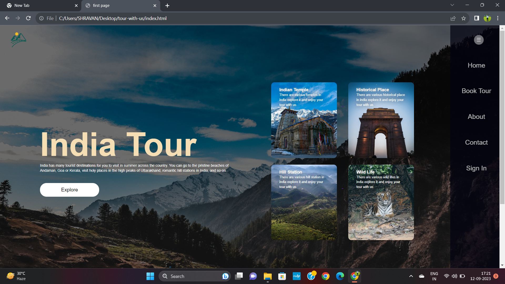
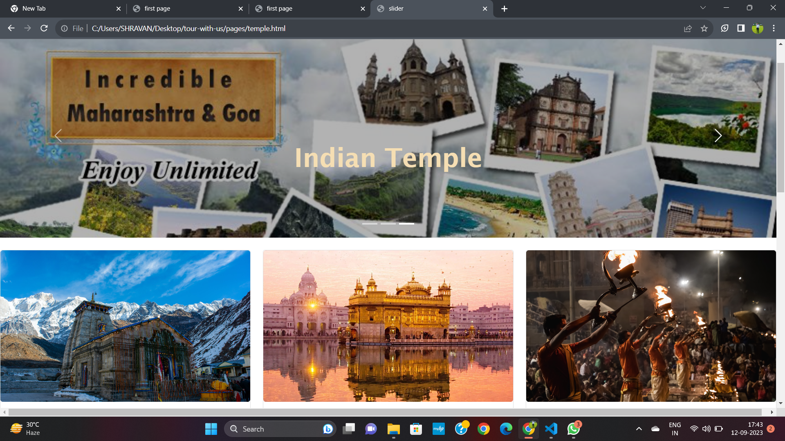
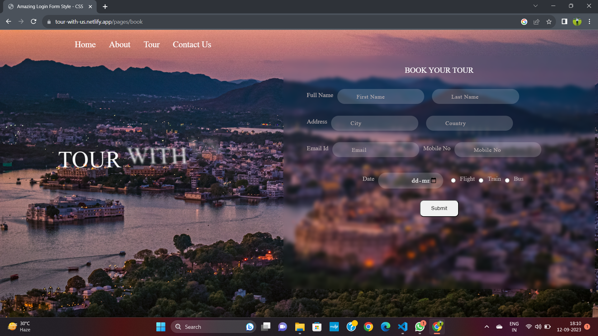

# Tour With Us

**home page**

[visit Tour with us](https://tour-with-us.netlify.app/)

 *Tourism is a social, cultural and economic phenomenon which entails the movement of people to countries or places outside their usual environment for personal or business/professional purposes. These people are called visitors (which may be either tourists or excursionists; residents or non-residents) and tourism has to do with their activities, some of which involve tourism expenditure..*

# Explore Indian Temple

[visit Indian Temple Page](https://tour-with-us.netlify.app/pages/temple)

Temples are considered one of the most important places in Hinduism. They are seen as a sacred place where Hindus can go to worship and connect with their gods. Temples hold an important place in one’s mind and are often seen as a symbol of hope. For many Hindus, a temple is a place of refuge during difficult times.

In history, there have been many famous temples that have been built. 

**Why are Temples Important?**

Temples are very important for one’s personal growth and development. They are a place where we can go to receive guidance from our Heavenly Father, learn more about His plan for us, and make covenants with Him. In the temple, we also receive power through priesthood ordinances that enable us to overcome challenges in our lives and return to live with Him someday.

# About Website

[About India Tour](https://tour-with-us.netlify.app/pages/aboutus)

**About
Incredible India**

Interesting and Intriguing, India offers incredible holiday experiences through its cultural, topography, and wildlife diversity. With these amazing and unique experiences, this south Asian country conveniently finds its way into the world tourism map as one of the finest destinations for a holistic vacation. India establishes its identity as the country of architectural masterpieces, making it an ideal travel destination to plan a heritage tour in the world. While Taj Mahal makes for the major draw on an India tour, there are a plethora of monuments and edifices in every India travel guide displaying the fine architecture and grandiose of different eras in the country.

## Ticket Booking ##

[For Ticket Booking Click Here](https://tour-with-us.netlify.app/pages/book)

*Ticket Your Book for tour your Favourite Places*

## Contact Us ##

 
 [For Contact Us click Here](https://tour-with-us.netlify.app/pages/contactus)

For Any Query Contact Us :

**Piyush Aglawe : 5327392637**

**Jayant Sarve : 8553936463**

**Shravan Bhoyar : 782802875**

**Jayesh Bisne : 7574837483**
